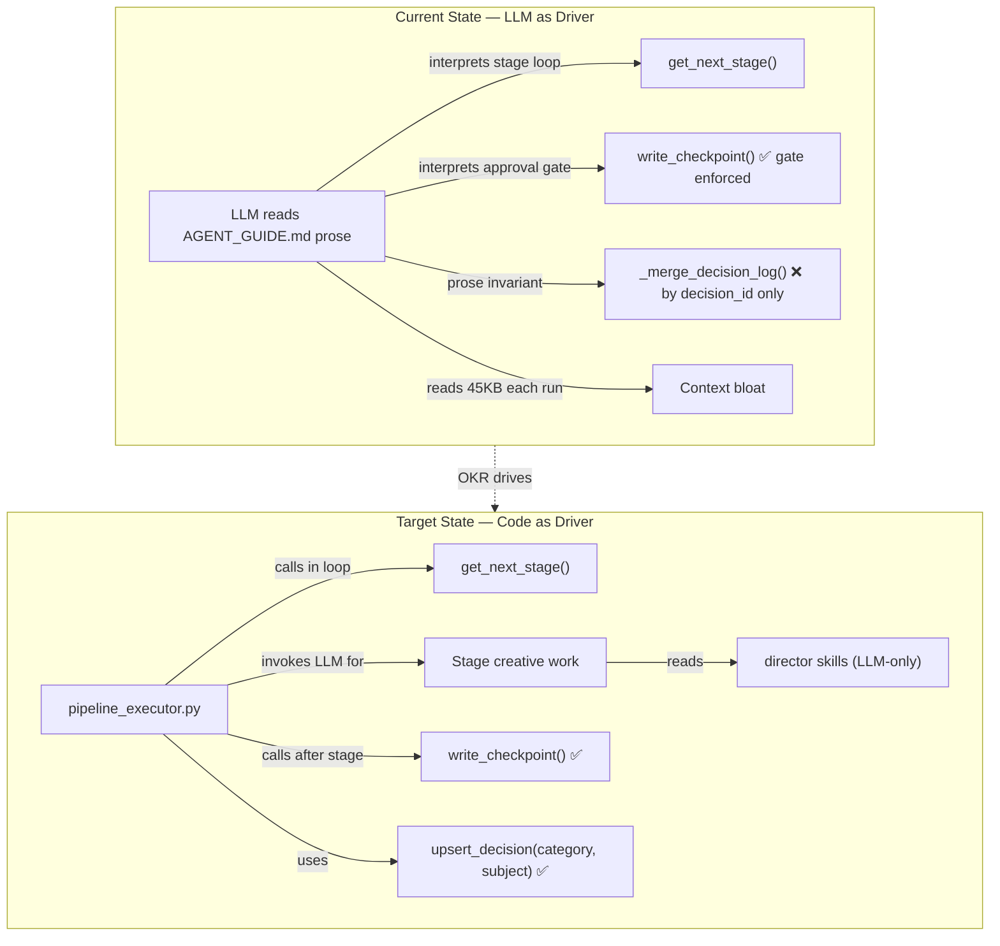

# OKR: OpenMontage Hybrid Executor
**Audit date:** 2026-07-08 | **Type:** Reverse Tornado Self-Correcting Loop

---

## Frame (Human-Ratified — Do Not Edit)

### Objective
Eliminate LLM-as-driver non-determinism in OpenMontage orchestration.

### Metric + Target
**Orchestration compliance rate** — % of pipeline runs where:
- Stage transitions driven by code (`pipeline_executor.py` calling `get_next_stage()`)
- `decision_log` board always shows current choice per `(category, subject)` pair

**Target: 100%** measured over 10 consecutive runs on `animated-explainer` pipeline.

### Anti-Goal 1 (Tripwire)
**Creative autonomy preservation** — LLM retains full control of creative decisions.

**Anti-metric:** Creative decision points touched by code constraints / total creative decision points.

**Tripwire: > 5%** — halt and escalate. This fires if the executor starts calling stage director skills or reviewer skills from Python code instead of delegating to LLM.

### Anti-Goal 2 (Tripwire)
**Orchestration overhead budget** — the executor must not make orchestration slower than the ~3-minute wall.

**Anti-metric:** Wall-clock sum of orchestration operations per pipeline run — stage transition resolution (`get_next_stage()`), checkpoint reads/writes, `decision_log` merges/upserts, manifest loading, gate checks. **Excludes** generation API calls (image/video/TTS) and LLM inference inside stages.

**Tripwire: > 180 s per run** — halt and escalate. Measured by timing instrumentation in `pipeline_executor.py` (per-operation timings emitted in progress events, summed at run end).

**Coverage review:**
| Candidate harm | Guardrail selected | Notes |
|---|---|---|
| Executor calls director skills in Python | Anti-metric 1 tripwire | Director skills must stay LLM-only |
| Executor hardcodes stage logic | Code review gate | Stage content = LLM; stage sequencing = code |
| upsert_decision() breaks existing decision_id dedup | Schema validation | Keep backward compat: new API wraps, not replaces |
| Pipeline executor bypasses existing gate enforcement | Integration test | `write_checkpoint()` gate is already code — preserve it |
| Executor adds slow orchestration (re-validating all checkpoints every loop, sync file polling) | Anti-metric 2 tripwire | Overhead sum ≤ 180 s/run; timing instrumentation mandatory in PKR-1 |

### Action Envelope
- Allowed: write `lib/pipeline_executor.py`, `lib/decision_log.py`, update `lib/checkpoint.py` helpers
- Allowed: write tests in `tests/`
- Forbidden: modify stage director skills (`.md` files under `skills/`)
- Forbidden: modify `schemas/artifacts/decision_log.schema.json`
- Forbidden: push to `main` directly — PR required

---

## Architecture Baseline (from code audit)



### Gap map
| Component | Status | Code location | Action needed |
|---|---|---|---|
| `get_next_stage()` | ✅ exists | `lib/checkpoint.py:514` | None — use as-is |
| Gate enforcement | ✅ code | `lib/checkpoint.py:382` | None — already raises |
| Stage transition loop | ❌ prose | AGENT_GUIDE.md | Write `lib/pipeline_executor.py` |
| `upsert_decision()` | ❌ missing | `lib/checkpoint.py:297` deduplicates by `decision_id` only | Write `lib/decision_log.py` |

---

## Work Decomposition

### DKR-1 — Probe pipeline_executor API surface
**Scope:** What does `get_next_stage()` need as inputs? What signals does each stage return that the executor must read to decide advance vs retry? Can the executor be tool-agnostic (works for all 12 pipelines)?

**Budget:** 1 discovery pass, read `lib/pipeline_loader.py` + 2 pipeline YAML manifests.

**Output:** Learning checkpoint — exact executor constructor signature, advance/retry contract, per-pipeline stage list shape.

**CKR/PKR candidates unlocked after:** DKR-1 checkpoint accepted.

---

### DKR-2 — Probe decision_log board rendering path
**Scope:** Does Backlot board already filter by `(category, subject)` latest-entry, or does it render raw array? If board already handles it, `upsert_decision()` is pure write-side fix. If board renders raw, both sides need work.

**Budget:** 1 discovery pass, read `backlot/` board rendering code.

**Output:** Learning checkpoint — board query pattern, confirmed write-side vs both-side fix.

**CKR/PKR candidates unlocked after:** DKR-2 checkpoint accepted.

---

### CKR-1 — Python executor drives stage loop
**Direct metric:** `decision_log` written by code for stage transitions (not by LLM prose interpretation). Proxy: 0 calls to `get_next_stage()` by LLM-initiated ad-hoc scripts per run.

**Mini reverse-tornado:**
- Discovery: DKR-1 must confirm executor API before PKR-1 starts
- Delivery: `lib/pipeline_executor.py` — `PipelineExecutor(project_id, pipeline_type).run(stage_runner_fn)`
- Stage runner fn = callable LLM provides → executor is content-agnostic

**PKR-1:** Write `lib/pipeline_executor.py`
- `__init__(project_id, pipeline_type, pipeline_dir=None)`
- `run(stage_runner: Callable[[str, dict], StageResult])` — loop until `get_next_stage()` returns None
- `StageResult`: dataclass with `artifacts`, `decisions`, `status`, `human_approved`
- Handle `awaiting_human`: pause loop, surface to caller, wait for resume signal
- Handle retry: max 2 retries per stage (mirrors reviewer protocol)
- Emit progress events (stdout JSON lines — Backlot can stream these)
- Timing instrumentation: each orchestration op (transition, checkpoint I/O, decision merge, gate check) timed; per-run overhead sum in final progress event. `awaiting_human` wall-clock excluded. Feeds anti-metric 2 directly.

**PKR-1 test:** `tests/test_pipeline_executor.py` — mock `stage_runner_fn`, assert stage order matches manifest, assert gate raised when `human_approved=False`.

---

### CKR-2 — decision_log upsert enforces (category, subject) key
**Direct metric:** Board never shows stale choice after user changes provider/voice/runtime — 0 stale entries per 10 runs.

**Mini reverse-tornado:**
- Discovery: DKR-2 must confirm board rendering before choosing fix scope
- Delivery: `lib/decision_log.py` — `upsert_decision(project_id, ...)` wraps `_merge_decision_log()`

**PKR-2:** Write `lib/decision_log.py`
```python
def upsert_decision(
    project_id: str,
    stage: str,
    category: str,       # enum from schema
    subject: str,        # unique key with category
    selected_option_id: str,
    options_considered: list[dict],
    reason: str,
    *,
    pipeline_dir: Path | None = None,
    user_approved: bool = False,
    confidence: float = 1.0,
) -> dict:
    """
    Upsert a decision by (category, subject) key.
    If prior entry exists with same pair, pushes selected option
    into prior entry's options_considered with rejected_because='superseded',
    appends new entry. Board always renders latest entry per pair as current.
    Returns the new decision dict.
    """
```
- Backward compat: keeps `decision_id` dedup in `_merge_decision_log()` — new API generates deterministic IDs from `f"{category}:{subject}:{timestamp}"`.
- Does NOT modify schema.

**PKR-2 test:** Assert round-trip: upsert voice=openai_onyx → upsert voice=Chirp3 → read log → latest entry for `(voice_selection, "Narration TTS provider")` is Chirp3, openai_onyx in `options_considered`.

---

## Three Anti-Goal Eval Points

### Point 1 — Admissibility (before each PKR starts)
Before writing any code for a PKR, check: does this move constrain creative decisions OR blow the overhead budget?

| Move | Anti-metric 1 cost | Anti-metric 2 cost | Verdict |
|---|---|---|---|
| Executor calls `director_skill.read()` from Python | HIGH — executor now owns creative | — | VETO |
| Executor calls `get_next_stage()` from Python | 0 — pure state machine | ms-scale | ADMIT |
| `upsert_decision()` validates category enum | 0 — write-side only | ms-scale | ADMIT |
| Executor reads `human_approval_default` from manifest | 0 — gate policy | ms-scale | ADMIT |
| Executor re-validates ALL checkpoints every loop iteration | 0 | O(stages²) file I/O + jsonschema | VETO — validate only current stage |
| Executor polls filesystem sync-waiting for human approval | 0 | unbounded wall-clock counted as overhead | VETO — pause/resume, wall-clock while `awaiting_human` excluded from budget |

### Point 2 — Direct read (after each PKR lands)
Run integration test on `animated-explainer` pipeline with mock stage_runner:
- Anti-metric 1: count creative decision points `pipeline_executor.py` touched directly — must stay 0.
- Anti-metric 2: read summed orchestration timings from executor progress events — must stay ≤ 180 s (expect < 5 s with mocked stages; real budget headroom for manifest loads + schema validation at scale).

### Point 3 — Paired read (at progress check)
**Goal metric up?** Run passes 10 times with consistent stage order → compliance rate = 100%.
**Anti-goal 1 held?** Creative decision points touched by code = 0%.
**Anti-goal 2 held?** Orchestration overhead ≤ 180 s on every one of the 10 runs.
All three must pass. Passing executor that calls director skills OR breaches time wall = BREAKING flag.

---

## Flags

| Flag | Condition | Action |
|---|---|---|
| **Cannot** | DKR-1 or DKR-2 budget exhausted, learning flatlined | Halt affected PKR, escalate to human with evidence |
| **Breaking** | Anti-metric 1 > 5% (executor touches creative decisions) OR anti-metric 2 > 180 s (orchestration overhead) | Halt PKR-1 immediately, redesign executor boundary or profile the hot path |
| **Pointless** | Both PKRs done, but LLM still reads AGENT_GUIDE.md prose to drive loop | Re-audit — executor not wired into production path |
| **Authority drift** | Executor modifies stage director skills or AGENT_GUIDE.md | Hard stop — outside action envelope |

---

## Operating Loop

**Cadence:** Per-session (not timed — this is dev work, not a recurring metric loop).

**Each session start:**
1. Read `.okra/runs/hybrid-executor/ledger.jsonl` — check last state
2. Freshness check: which PKRs are done per `tests/` passing?
3. Identify next DKR or PKR to execute
4. Admissibility check before starting work
5. Execute, write progress
6. Post-move anti-metric read
7. Paired read if CKR metric moved

**Lag window:** Test results are immediate (no lag). Orchestration compliance rate measured over 10 runs — allow 1-session lag after executor is wired.

**Storage:** `.okra/runs/hybrid-executor/` per-run store. Ledger is append-only. Status files are generated views.

---

## Execution Order

```mermaid
gantt
    title Hybrid Executor OKR — Execution Sequence
    dateFormat X
    axisFormat %s

    section Discovery
    DKR-1 pipeline_executor API surface  :d1, 0, 1
    DKR-2 board rendering path           :d2, 0, 1

    section CKR-1 Executor
    PKR-1 lib/pipeline_executor.py       :after d1, 1, 2
    PKR-1 tests                          :after d1, 1, 2

    section CKR-2 Decision Log
    PKR-2 lib/decision_log.py            :after d2, 1, 2
    PKR-2 tests                          :after d2, 1, 2

    section Verify
    Integration test 10 runs             :v1, after PKR-1 PKR-2, 1, 2
    Paired goal+antigoal read            :after v1, 1, 2
```

DKR-1 and DKR-2 run in parallel (no shared state). PKR-1 and PKR-2 run in parallel after their respective DKRs. Integration test is sequential — needs both.

---

## Human-Only Line

Human owns:
- The objective target (100% compliance rate)
- Anti-goal 1 threshold (5% creative autonomy tripwire)
- Anti-goal 2 threshold (180 s orchestration overhead tripwire)
- Decision to NOT implement executor (keep prose-driver architecture)
- Decision to expand scope beyond `lib/` (e.g., rewire AGENT_GUIDE.md itself)

Loop cannot switch goal to "improve video quality" or "add new pipeline" to avoid flat compliance metric.

---

## What Stays Markdown (Never Touched)

- `skills/pipelines/**/*-director.md` — creative direction, prompting, taste
- `skills/meta/reviewer.md` — fuzzy review verdict
- `.agents/skills/**` — vendor/technology knowledge base
- `AGENT_GUIDE.md` prose about creative decisions — only orchestration prose gets replaced by code behavior

