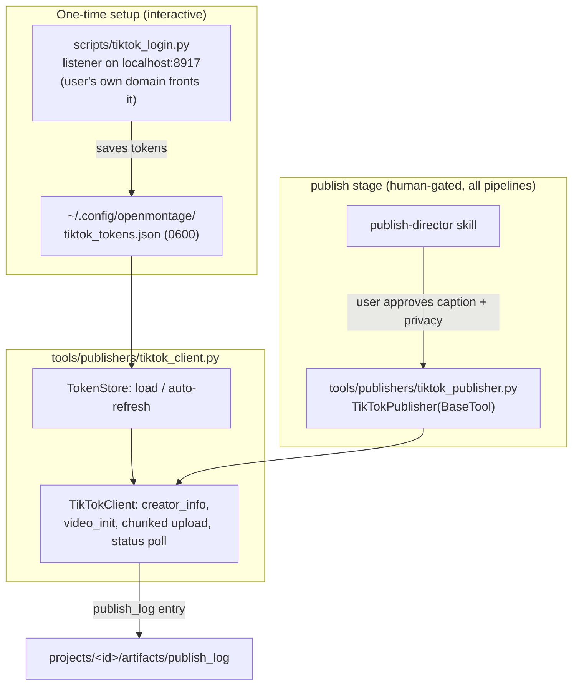

# TikTok Publisher — Design

Date: 2026-07-05
Status: approved (pending user spec review)
Branch: `feat/tiktok-publisher`

## Goal

When a pipeline's video is finished and the user approves the publish gate, OpenMontage posts the render directly to the user's TikTok account via the official Content Posting API (Direct Post).

## Validated by probe

A live probe (sandbox app, 2026-07-05) confirmed the full loop end-to-end:

- OAuth authorization code flow with scopes `user.info.basic,video.publish`; access token 24h, refresh token 365 days, refresh tokens may rotate on refresh.
- `POST /v2/post/publish/creator_info/query/` returns `privacy_level_options`, `max_video_post_duration_sec`, creator username/avatar.
- `POST /v2/post/publish/video/init/` (FILE_UPLOAD) → `publish_id` + `upload_url` (valid 1h).
- `PUT upload_url` with `Content-Range: bytes {first}-{last}/{total}` → 201.
- `POST /v2/post/publish/status/fetch/` → `PROCESSING_UPLOAD` → `PUBLISH_COMPLETE` in ~10s for a 4MB clip.

Constraints confirmed:

- **Unaudited/sandbox apps can only post `SELF_ONLY` / `MUTUAL_FOLLOW_FRIENDS` / `FOLLOWER_OF_CREATOR`** — `PUBLIC_TO_EVERYONE` requires passing TikTok's app audit (2–4 weeks).
- Rate limits: 6 API requests/min per token; ~15 posts/day per creator.
- TikTok rejects `localhost`/`127.0.0.1` redirect URIs — a real HTTPS redirect URI is required for login.

## Decisions (user-approved)

| Decision | Choice |
|---|---|
| Post trigger | Existing human-approval gate at the `publish` stage (no unattended posting) |
| Login UX | Separate interactive setup script; publisher tool is fully headless |
| Tunnel for OAuth callback | **None managed by us** — user points their own domain/tunnel at a localhost port |
| Pipeline wiring | `tiktok_publisher` added to `tools_available` of **every** publish stage |
| AI labeling | `is_aigc: true` always |
| Code structure | Shared typed client module used by both tool and login script |

## Architecture

## Components

### 1. `tools/publishers/tiktok_client.py`

Typed, BaseTool-free client — unit-testable with mocked HTTP.

- Dataclasses: `TikTokTokens` (access/refresh/open_id/expires_at, `save()`/`load()`, file mode 0600), `CreatorInfo`, `PublishResult`.
- `TokenStore`: loads `~/.config/openmontage/tiktok_tokens.json`, auto-refreshes when <5 min to expiry, persists rotated refresh tokens.
- `TikTokClient`: `creator_info()`, `init_video_post(post_info, video_size, chunk_size, total_chunk_count)`, `upload_chunks(upload_url, video_path)`, `fetch_status(publish_id)`, `wait_for_publish(publish_id, timeout)`.
- Endpoints and auth headers exactly as validated by the probe (`open.tiktokapis.com/v2`, Bearer token, form-encoded token endpoint).
- Credentials from env: `TIKTOK_CLIENT_KEY`, `TIKTOK_CLIENT_SECRET` (loaded via the repo dotenv mechanism).

### 2. `tools/publishers/tiktok_publisher.py`

`TikTokPublisher(BaseTool)`:

- Registry metadata: `tier=PUBLISH`, `capability="publish"`, `provider="tiktok"`, `runtime=API`, `stability=BETA`, `execution_mode=SYNC`.
- `dependencies = ["TIKTOK_CLIENT_KEY", "TIKTOK_CLIENT_SECRET"]`; availability additionally requires the token file to exist. When unavailable, `install_instructions` explains: set env keys, then run `python3 scripts/tiktok_login.py`.
- Input schema: `video_path` (required), `title` (caption, hashtags inline, ≤2200 chars), `privacy_level` (required; enum of the four TikTok levels), `disable_comment`, `disable_duet`, `disable_stitch`, `video_cover_timestamp_ms`. `is_aigc` is not an input — always sent `true`.
- Execution order:
  1. Validate `video_path` exists; probe size.
  2. `creator_info()` — fail fast if `privacy_level` not in `privacy_level_options` (`privacy_level_option_mismatch` prevented before upload) and if video duration exceeds `max_video_post_duration_sec` (via ffprobe).
  3. Init with 10MB chunks (single chunk when size ≤ chunk size; last chunk carries the remainder per TikTok chunk rules).
  4. Upload chunks; poll status to `PUBLISH_COMPLETE` / `FAILED` (poll every 5s, timeout 5 min).
  5. Return schema-valid `publish_log`: `platform: "tiktok"`, `status: "published"` (or `"failed"`), `video_id` (publish_id), `visibility` mapped from privacy level (`PUBLIC_TO_EVERYONE`→`public`, `SELF_ONLY`→`private`, others→`unlisted`), `metadata_used`.
- Validates the publish_log against `schemas/artifacts/publish_log.schema.json` before returning (same pattern as `export_bundle`).

### 3. `scripts/tiktok_login.py`

One-time interactive login. No tunnel management.

- Reads `TIKTOK_REDIRECT_URI` (required; the user's own HTTPS URL, registered in the TikTok app) and `TIKTOK_CALLBACK_PORT` (default `8917`).
- Binds `127.0.0.1:<port>`; only a GET whose path ends in `callback` with a `code` param completes the flow (health checks/scanners get 404 and don't consume the listener).
- Prints the authorize URL (state = CSRF token), waits up to 5 min, exchanges the code, saves tokens, prints the connected username via `creator_info`.
- The user is responsible for pointing their domain/tunnel at the localhost port before running it.
- Also supports `--refresh` (force token refresh to verify stored credentials) and `--status` (print connected account + token expiry).

### 4. Manifest wiring

Add `tiktok_publisher` to `tools_available` of the `publish` stage in every pipeline manifest that has one. Gates unchanged (`human_approval_default: true`).

### 5. Publish-director guidance

Add a short TikTok section to the publish-director skills (shared wording): when the brief targets TikTok and `tiktok_publisher` is available — query creator info first, present the real `privacy_level_options` at the approval checkpoint (never assume PUBLIC; unaudited apps can't), show caption, log platform + privacy choice in `decision_log` (`category: "publish_target"`), then call the tool after approval. Note the ~15 posts/day cap for clip-factory batch runs.

## Error handling

- Missing env keys or token file → tool reports `UNAVAILABLE` with setup instructions (registry setup-offer protocol); at run time, a structured blocker — never a browser launch mid-pipeline.
- Refresh failure (revoked/expired refresh token) → blocker instructing re-run of the login script.
- TikTok API errors surfaced verbatim with their error code; `publish_log` entry `status: "failed"` with the code in `metadata_used.error`.
- Upload URL expiry (1h) is a non-issue at 10MB chunks but the error is still mapped cleanly.

## Testing

Unit tests (`tests/`, mocked `requests`, no live API):

- Token refresh: expiry detection, rotated refresh token persisted, refresh failure raises.
- Chunk math: size < chunk (1 chunk), exact multiple, remainder on last chunk; `Content-Range` headers correct.
- Privacy validation: mismatch fails before init/upload.
- publish_log output validates against the canonical schema for success and failure paths.
- Availability logic: missing env / missing token file → UNAVAILABLE.

The live sandbox probe stands as the integration evidence; no live calls in CI.

## Out of scope

- TikTok app audit / public posting (user may pursue later; tool already supports `PUBLIC_TO_EVERYONE` once the app is audited).
- `PULL_FROM_URL` source mode (requires domain verification; FILE_UPLOAD covers our case).
- Photo posts, drafts-inbox mode, other platforms (YouTube etc. are separate providers under `capability="publish"`).
