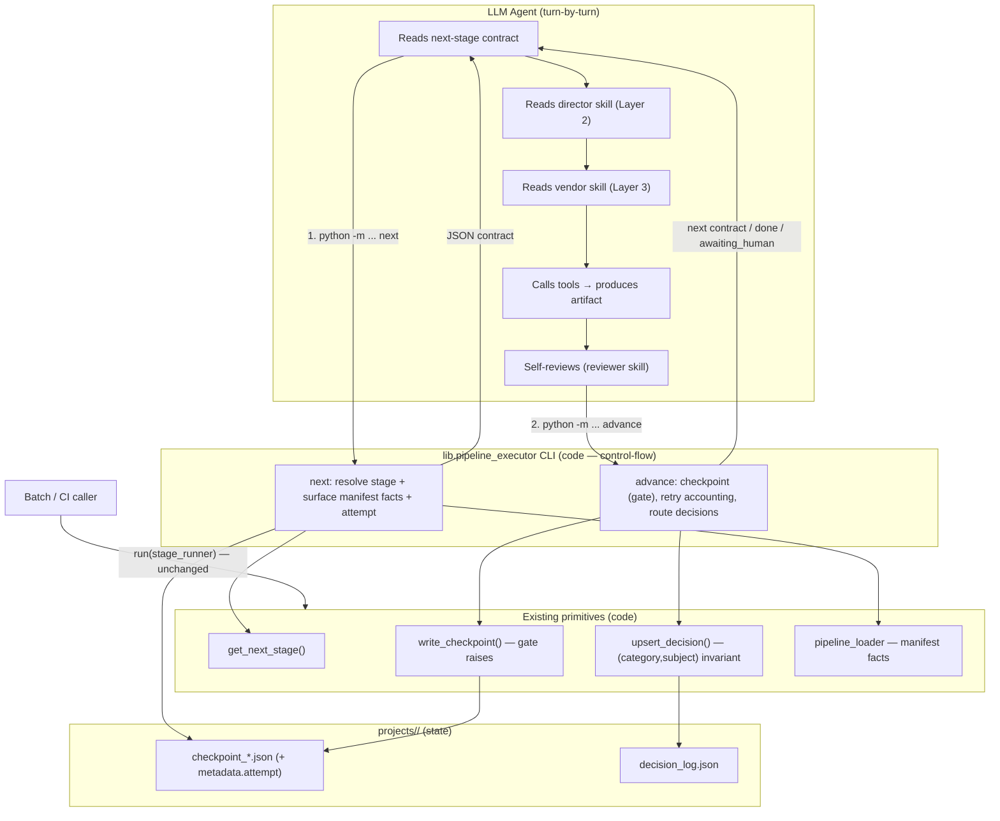

# Design: Wire the Pipeline Executor into the Production Path

**Date:** 2026-07-08
**Branch:** `feat/wire-executor`
**Status:** design — awaiting user review

---

## Problem

`lib/pipeline_executor.py` and `lib/decision_log.py` are merged (PR #5) but nothing invokes them in the production path. The interactive agent still drives the pipeline by interpreting prose in `AGENT_GUIDE.md`. This is the OKR's **"Pointless" flag**: the deterministic code exists but the metric (orchestration compliance) does not move because the live path never touches it.

Two obstacles block naive wiring:

1. **Frozen C3 architecture.** `ref-instruction-layering` and `c3-1` (Production Engine) explicitly freeze the prose-driver decision:
   - *"Putting orchestration knowledge in Python would fork the source of truth and make the agent's behavior untunable without code changes."*
   - *"Explicitly NOT responsible for orchestration decisions — the agent is the orchestrator."*
2. **Execution-model mismatch.** `PipelineExecutor.run(stage_runner)` is an in-process Python loop. In the interactive path the LLM drives turn-by-turn via tool calls; it cannot be passed as a Python callback.

**Chosen stance (user-ratified):** Full reversal — the executor becomes the mandated driver for all runs. Amend the frozen C3 facts through a change-unit.

---

## The reconciliation: split "orchestration" in two

The frozen ref conflates two concerns. The amendment separates them:

| Concern | Owner after change | Rationale |
|---|---|---|
| **Control-flow** — stage sequencing, gate enforcement, retry cap, decision-log invariant | **Code** (executor) | Deterministic, testable, auditable |
| **Creative content** — what each stage produces, prompt authoring, taste, review verdict | **LLM + skills** (markdown) | Fuzzy judgment; the ref's tunability argument still holds here |

The ref's core premise ("agent IS the intelligence, instructions are its program") survives — for the creative layer. Only the deterministic spine moves to code.

---

## Architecture



**Two surfaces, one spine:**
- `run(stage_runner)` — in-process loop, unchanged. For batch/localization/CI where a real Python `stage_runner` exists.
- CLI `next` / `advance` — cross-turn, agent-driven. NEW. The interactive driver.

Both share the transition/gate/retry/decision primitives.

---

## Component 1 — Interactive driver (`lib/pipeline_executor.py`)

### `next` subcommand
```
python -m lib.pipeline_executor next <project_id> <pipeline_type>
```
Behavior:
1. `get_next_stage()` → stage (or `done:true` when none remain).
2. Load manifest facts for that stage via `pipeline_loader`: `director_skill` (skill path), `produces` (canonical artifact name), `tools_available`, `review_focus`, `success_criteria`, `human_approval_default`.
3. Read persisted `attempt` from the stage's `in_progress` checkpoint metadata (default 1 if none).
4. Surface `prior_artifacts` — canonical artifact names already completed (names, not full payloads, to stay lean).
5. Write/refresh the `in_progress` checkpoint for the stage on entry (with `metadata.attempt`).
6. Print JSON contract to stdout.

Output shape:
```json
{
  "done": false,
  "stage": "script",
  "director_skill": "skills/pipelines/animated-explainer/script-director.md",
  "produces": "script",
  "tools_available": [],
  "review_focus": ["..."],
  "success_criteria": ["..."],
  "human_approval_default": true,
  "attempt": 1,
  "max_revisions": 3,
  "prior_artifacts": ["research_brief", "proposal_packet"]
}
```

### `advance` subcommand
```
python -m lib.pipeline_executor advance <project_id> <pipeline_type> \
    --status completed|awaiting_human|failed|retry \
    [--artifact-file <path>] [--human-approved] \
    [--decisions-file <path>] [--review-file <path>] [--cost-file <path>]
```
Behavior by status:
- **completed / awaiting_human / failed:** call `write_checkpoint(...)` with the manifest gate (`human_approval_required = get_stage_human_approval_default(...)`), passing `human_approved`, `review`, `cost_snapshot`, `artifacts`. Gate violation propagates (code raises `CheckpointValidationError`).
- **retry:** read current `attempt` from in_progress metadata, increment, enforce cap. If `attempt > max_revisions`: write `failed` checkpoint, print `{"stopped":"retries_exhausted"}`. Else rewrite in_progress with bumped `attempt`, print refreshed contract for the same stage.
- **decisions:** if `--decisions-file` present, each decision routed through `upsert_decision()` — the `(category, subject)` invariant is enforced at the CLI boundary, not by agent memory. The decisions file is a JSON array of `{stage, category, subject, selected, options_considered, reason, [user_approved, confidence, user_visible]}`.

Output: next-stage contract (same shape as `next`), or `{"done":true}`, or `{"stopped":"awaiting_human","stage":...}`, or `{"stopped":"retries_exhausted","stage":...}`.

### New executor work
- **Persist `attempt` across CLI calls.** Currently `run()` holds `attempt` in-memory. Add: `in_progress` checkpoint writes carry `metadata.attempt`; `next`/`advance` read and write it. `run()` unchanged (its in-memory loop still works; it may optionally also stamp metadata for board parity).
- Argparse `__main__` block mirroring `backlot/__main__.py` structure (subcommands, JSON to stdout, non-zero exit on error).
- A thin internal helper `resolve_stage_contract(project_id, pipeline_type) -> dict` shared by `next` and `advance`'s "return next" path, so the JSON contract has one source.

### Boundary constraint (anti-goal preserved)
The CLI reads manifest facts and surfaces the *path* to the director skill. It NEVER reads the skill content, never authors prompts, never calls generation tools, never makes a creative choice. Creative work happens in the agent's turns between `next` and `advance`.

---

## Component 2 — C3 change-unit

**Prerequisite:** the local C3 cache has a broken seal (`canvases/component.md`). `c3 repair` currently refuses. Resolve the seal (reseal canonical files) before opening the change-unit. If repair cannot be made to work, fall back to documenting the intended C3 edits in the spec and applying them once the seal is fixed — but do NOT hand-edit `.c3/` instance files.

Change-unit (`c3 change new wire-executor`):
1. **Amend `ref-instruction-layering`** — "Why"/"How" sections: introduce the control-flow vs creative-content split. Orchestration *control-flow* (stage transitions, gate enforcement, retry accounting, decision invariant) lives in code (the executor); orchestration *creative content* stays with agent + skills. The three-layer reading order is unchanged for creative work; it is now *invoked by* the executor's `next` contract rather than walked from prose.
2. **Amend `c3-1` Production Engine** — responsibility line: `"Explicitly NOT responsible for orchestration decisions — the agent is the orchestrator"` → `"Owns orchestration control-flow (the pipeline executor: stage transitions, gate enforcement, retry accounting, decision-log invariant). The agent owns creative content per stage, guided by skills."`
3. **Add component `c3-105` — Pipeline Executor & Decision Log** under `c3-1`. Goal: "Deterministic driver: resolve/advance stages, enforce gates and retry caps, enforce the decision-log (category, subject) invariant. Exposes an in-process `run(stage_runner)` and an interactive `next`/`advance` CLI."

No rule changes — no existing rule encodes the prose-driver stance (the two rules are `rule-tool-contract`, `rule-project-workspace`, both untouched).

---

## Component 3 — `AGENT_GUIDE.md` rewrite

Targeted edits, not a full rewrite:

- **"Orchestrator" section (lines ~181-201):** replace the prose state-machine walk with: run `python -m lib.pipeline_executor next` to get the current stage + which director skill to read + what gate applies; do the creative work; run `advance` to checkpoint and progress. The executor owns transitions, gates, and retry caps.
- **"Rule Zero" (lines ~49-68):** keep the "read director skill / Layer 3 before tools" mandate (that is creative-layer, still true). Add that stage sequencing is now driven by `next`, not by the agent choosing the next stage.
- **"Re-log Changed Decisions" (lines ~117-121):** replace "you MUST append a new decision_log entry..." prose with "pass changed decisions to `advance --decisions-file` (or call `upsert_decision()`); the `(category, subject)` invariant is enforced in code."
- **"Do NOT: Write ad-hoc Python scripts to call tools directly"** stays — using the executor CLI is not ad-hoc tool calling.

`PROJECT_CONTEXT.md` Layer Map / key-files: add the executor as the control-flow driver.

---

## Data flow (interactive run)

```mermaid
sequenceDiagram
    participant U as User
    participant AG as LLM Agent
    participant EX as executor CLI
    participant FS as projects/<id>/

    AG->>EX: next <proj> <pipeline>
    EX->>FS: get_next_stage(), read attempt
    EX->>FS: write in_progress checkpoint
    EX-->>AG: {stage, director_skill, gate, attempt, ...}
    AG->>AG: read skill, call tools, produce artifact, self-review
    AG->>EX: advance --status completed --artifact-file a.json --decisions-file d.json
    EX->>FS: write_checkpoint() [gate enforced]
    EX->>FS: upsert_decision() per decision
    alt gated stage, not yet approved
        EX-->>AG: {stopped: awaiting_human, stage}
        AG->>U: present artifact + cost; END TURN
        U->>AG: approve
        AG->>EX: advance --status completed --human-approved
        EX->>FS: write_checkpoint(human_approved=True)
        EX-->>AG: next contract
    else auto-proceed stage
        EX-->>AG: next contract
    end
    Note over AG,EX: loop until {done: true}
```

---

## Testing

New: `tests/test_pipeline_executor_cli.py`
1. `next` on fresh project → returns first stage contract with correct director_skill, gate, attempt=1; writes in_progress checkpoint.
2. `next` → `advance completed (approved)` → `next` returns the following stage. Full walk of `framework-smoke` to `{done:true}`.
3. Gate: `advance --status completed` without `--human-approved` on a gated stage → non-zero exit, `CheckpointValidationError` surfaced.
4. Attempt persistence: `advance --status retry` twice across separate CLI invocations → `next`/contract shows attempt incrementing; third retry past `max_revisions` → `retries_exhausted` + failed checkpoint.
5. Decisions: `advance --decisions-file` with a revised `(voice_selection, "Narration TTS provider")` → `decision_log.json` has both entries, latest current, prior superseded (reuses the PKR-2 invariant, now exercised through the CLI).
6. `awaiting_human`: `advance --status awaiting_human` → `{stopped:awaiting_human}`, checkpoint status awaiting_human on disk; resume path via subsequent `advance completed --human-approved`.

Existing `tests/test_pipeline_executor.py` and `tests/test_decision_log.py` stay green (run() path unchanged).

Run scoped only: `python -m pytest tests/test_pipeline_executor_cli.py tests/test_pipeline_executor.py tests/test_decision_log.py -q`.

---

## Verification against the OKR anti-goals

- **Anti-goal 1 (creative autonomy ≤ 5%):** the CLI surfaces the skill *path* and never reads skill content or makes creative choices — creative decision points touched by code stay 0. Assert: executor source contains no skill-content reads.
- **Anti-goal 2 (orchestration overhead ≤ 180 s):** `next`/`advance` are short-lived processes; each call is manifest-load + a few file I/O ops. Well within budget. (Process startup cost is per-call but bounded; not counted against the in-run overhead metric which applies to `run()`.)
- **"Pointless" flag cleared:** the live interactive path now invokes `get_next_stage` (via `next`) and `upsert_decision` (via `advance`) — the metric can move.

---

## Out of scope (YAGNI)

- No long-lived executor daemon / session server — cross-turn state lives on disk (checkpoints), which already exists.
- No migration of existing in-flight projects — `next` resolves from existing checkpoints; legacy projects resume normally.
- No changes to director skills, reviewer skill, or `.agents/skills/` — creative layer untouched.
- No rewrite of `run(stage_runner)` — batch surface unchanged.

---

## Rollout

Worktree `feat/wire-executor` → implement CLI + tests → fix C3 seal → C3 change-unit → AGENT_GUIDE edits → PR to main. Executor CLI and C3/guide edits can land in one PR (they are coupled: the guide points at the CLI, the C3 facts describe it).
